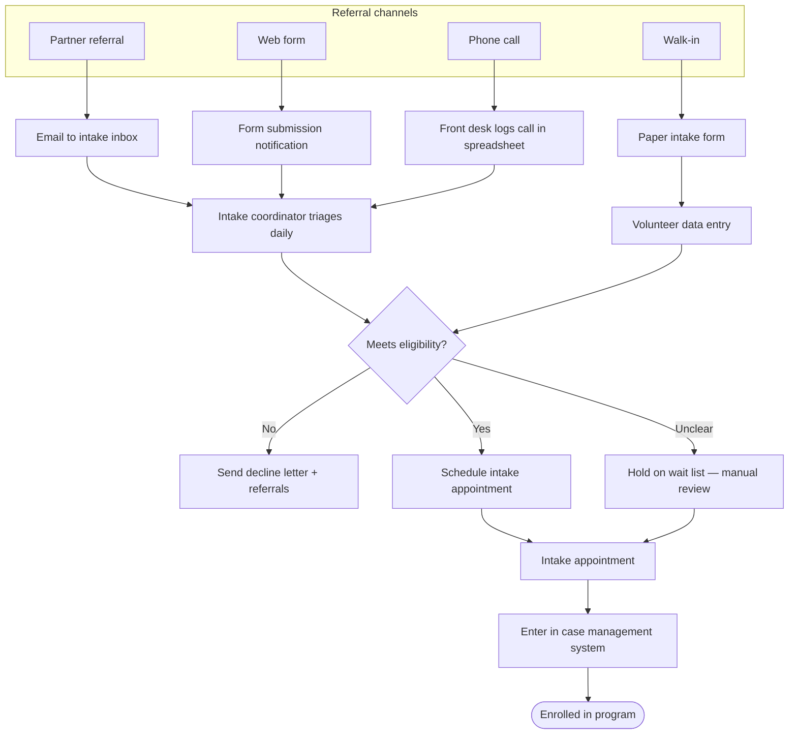

# Nonprofit client intake — current state

```json
{
  "id": "nonprofit-intake-current-state",
  "title": "Nonprofit client intake — current state",
  "type": "process_map",
  "status": "draft",
  "scope": "Fictional community health nonprofit — new client intake from first contact to enrolled in program",
  "tags": ["nonprofit", "intake", "current-state"],
  "externalUrl": null,
  "updated": "2026-06-10"
}
```

## Context

Fictional example for workshopping process map format. Represents a common nonprofit pattern: referrals arrive through multiple channels, eligibility is checked manually, and enrollment data lives in a spreadsheet until someone enters it into the case management system.

Use this map to test Mermaid rendering in the portal. For a client deliverable, a FigJam or Miro board would typically replace or supplement the diagram below.

## Map



## Pain points

- Four intake channels with no single queue — things get lost in email
- Eligibility criteria interpreted differently by staff
- 2–5 day lag between paper form and spreadsheet entry
- Case management system is "system of record" but data arrives late
- No visibility for program managers on pipeline volume

## Open questions

- Should eligibility pre-screening move to the web form?
- Who owns the wait list — intake coordinator or program director?
- Is the spreadsheet temporary or has it become permanent infrastructure?

## Review notes

- [2026-06-10] Initial seed — fictional nonprofit scenario for portal demo
