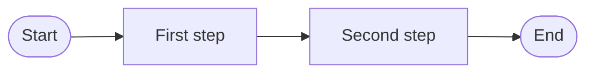

# [Process map title]

```json
{
  "id": "your-process-map-id",
  "title": "[Process map title]",
  "type": "process_map",
  "status": "draft",
  "scope": "[What process, which state — e.g. client intake, current state]",
  "tags": [],
  "externalUrl": null,
  "updated": "YYYY-MM-DD"
}
```

## Context

What service or workflow this map covers, who requested it, and what decisions it will inform.

## Map



For complex maps, use `externalUrl` in the metadata to link to FigJam, Miro, or a PDF export.

## Pain points

- Pain point 1
- Pain point 2

## Open questions

- Question still unresolved in this draft?

## Review notes

- [YYYY-MM-DD] Initial draft
